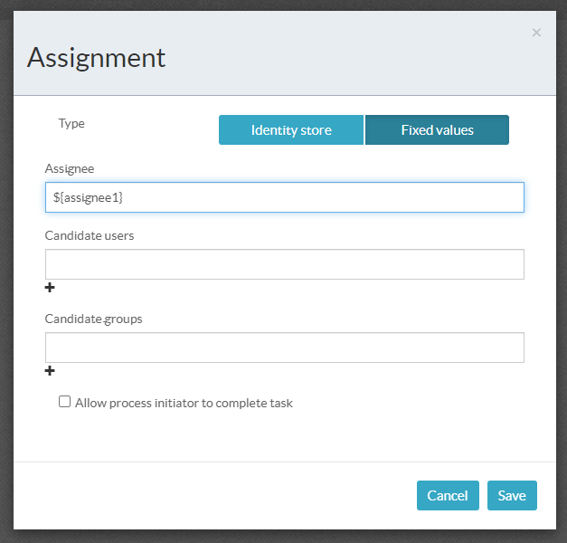
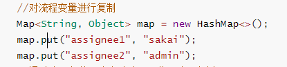
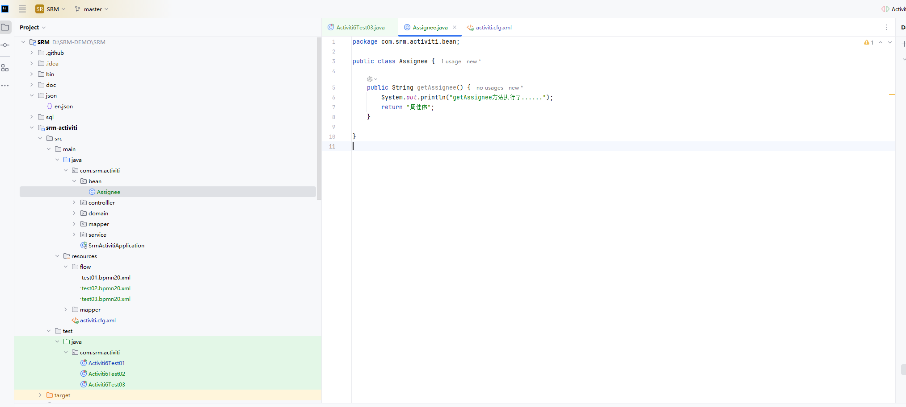
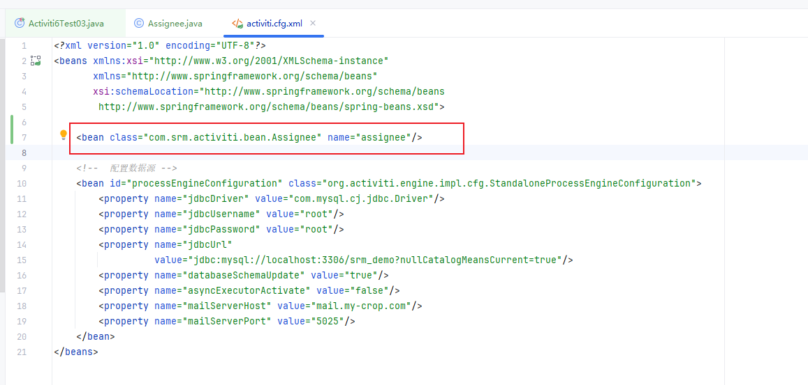
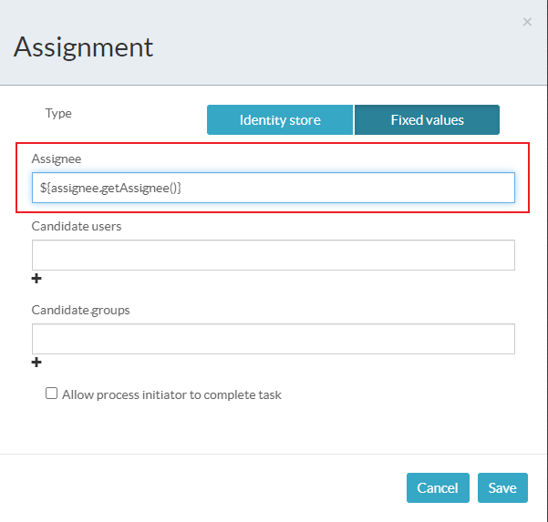

[toc]

# Activiti的学习

## 准备工作

- 引入依赖

```xml
        <!-- https://mvnrepository.com/artifact/org.activiti/activiti-engine -->
        <dependency>
            <groupId>org.activiti</groupId>
            <artifactId>activiti-engine</artifactId>
            <version>6.0.0</version>
        </dependency>

```

```xml	
        <dependency>
            <groupId>com.mysql</groupId>
            <artifactId>mysql-connector-j</artifactId>
            <scope>runtime</scope>
        </dependency>
```

```xml
        <!-- https://mvnrepository.com/artifact/org.mybatis/mybatis -->
        <dependency>
            <groupId>org.mybatis</groupId>
            <artifactId>mybatis</artifactId>
            <version>3.4.6</version>
        </dependency>
```

- 注意
  - activiti6需要Java8版本，mybatis3.4.x版本。
  - activiti7需要Java11版本。
- 配置文件**activiti.cfg.xml**

```xml
<?xml version="1.0" encoding="UTF-8"?>
<beans xmlns:xsi="http://www.w3.org/2001/XMLSchema-instance"
       xmlns="http://www.springframework.org/schema/beans"
       xsi:schemaLocation="http://www.springframework.org/schema/beans
        http://www.springframework.org/schema/beans/spring-beans.xsd">

    <!--  配置数据源 -->
    <bean id="processEngineConfiguration" class="org.activiti.engine.impl.cfg.StandaloneProcessEngineConfiguration">
        <property name="jdbcDriver" value="com.mysql.cj.jdbc.Driver"/>
        <property name="jdbcUsername" value="root"/>
        <property name="jdbcPassword" value="root"/>
        <property name="jdbcUrl"
                  value="jdbc:mysql://localhost:3306/srm_demo?nullCatalogMeansCurrent=true"/>
        <property name="databaseSchemaUpdate" value="true"/>
        <property name="asyncExecutorActivate" value="false"/>
        <property name="mailServerHost" value="mail.my-crop.com"/>
        <property name="mailServerPort" value="5025"/>
    </bean>
</beans>
```

- 创建activiti所需要的数据库表格

```java
    /**
     * 获取processEngine对象
     */

    @Test
    public void test1() {
        ProcessEngine processEngine = ProcessEngines.getDefaultProcessEngine();
    }
	//执行以上代码会自动在数据库中生成activiti所需要的25张表格
```

- 表如下


## 操作流程

- 部署流程

```java
    @Test
    public void activitiDeploy() {
        ProcessEngine processEngine = ProcessEngines.getDefaultProcessEngine();
        RepositoryService repositoryService = processEngine.getRepositoryService();

        Deployment deployment = repositoryService.createDeployment()
                .addClasspathResource("flow/test01.bpmn20.xml")
                .name("first")
                .deploy();
    }
```

**addClasspathResource("flow/test01.bpmn20.xml")**	指定bpmn的获取路径

**name("first")**	为流程命名

- 查询部署流程相关信息

```java
    @Test
    public void queryDeploy() {
        ProcessEngine processEngine = ProcessEngines.getDefaultProcessEngine();
        RepositoryService repositoryService = processEngine.getRepositoryService();

        List<ProcessDefinition> processDefinitions = repositoryService.createProcessDefinitionQuery().list();
        for (ProcessDefinition processDefinition : processDefinitions) {
            System.out.println("processDefinition.getId() = " + processDefinition.getId()); //获取流程定义ID
            System.out.println("processDefinition.getName() = " + processDefinition.getName());	//获取流程名称
            System.out.println("processDefinition.getDescription() = " + processDefinition.getDescription());	//获取流程的描述
        }

    }
```

- 发起流程

```java
    /**
     * 发起一个流程
     */
    @Test
    public void initiateProcess() {
        ProcessEngine engine = ProcessEngines.getDefaultProcessEngine();
        //发起流程
        RuntimeService runtimeService = engine.getRuntimeService();
        //通过流程定义ID来启动流程，获取流程实例
        ProcessInstance processInstance = runtimeService.startProcessInstanceById("test01:1:4");	//processDefinition.getId()
        System.out.println("processInstance.getId() = " + processInstance.getId());
        System.out.println("processInstance.getDeploymentId() = " + processInstance.getDeploymentId());
    }
```

- 代办查询

```java
    /**
     * 代办的查询
     */
    @Test
    public void agentQuery() {
        ProcessEngine engine = ProcessEngines.getDefaultProcessEngine();
        TaskService taskService = engine.getTaskService();
        //对应act_ru_task这张表的记录
        List<Task> tasks = taskService.createTaskQuery().taskAssignee("sakai").list(); //taskAssignee("sakai") "sakai"指的是代办人名称
        if (tasks != null && !tasks.isEmpty()) {
            for (Task task : tasks) {
                String id = task.getId();
                System.out.println("id = " + id);
                String name = task.getName();
                System.out.println("name = " + name);
            }
        } else {
            System.out.println("没有待办任务");
        }
    }
```

- 任务审批

```java
    /**
     * 任务审批
     */
    @Test
    public void taskAudit() {
        ProcessEngine engine = ProcessEngines.getDefaultProcessEngine();
        TaskService taskService = engine.getTaskService();
        List<Task> tasks = taskService.createTaskQuery().taskAssignee("admin").list();
        if (tasks != null && !tasks.isEmpty()) {
            for (Task task : tasks) {
                String id = task.getId();
                System.out.println("id = " + id);
                String name = task.getName();
                System.out.println("name = " + name);

                taskService.complete(task.getId()); //根据任务ID完成任务审批
            }
        } else {
            System.out.println("没有待办任务");
        }
    }
```


## 表结构

|      表名称       |                          说明                          |
| :---------------: | :----------------------------------------------------: |
| act_re_deployment |      部署流程的记录表：一次部署行为会产生一条数据      |
|  act_re_procdef   |             流程定义表：一张流程图对应的表             |
|  act_hi_procinst  |    流程实例表：发起一个流程，就会创建对应的一条数据    |
|    act_ru_task    | 流程待办表：当前需要审批的记录表，节点审批后就会被删除 |
|  act_hi_actinst   |            历史记录：流程审批节点的审批记录            |
|  act_ru_variable  |                       流程变量表                       |
|                   |                                                        |

## 表达式

### 值表达式

- **${var}	值表达式**




```java
    @Test
    public void test3() {
        ProcessEngine engine = ProcessEngines.getDefaultProcessEngine();
        //发起流程
        RuntimeService runtimeService = engine.getRuntimeService();
        //对流程变量进行复制
        Map<String, Object> map = new HashMap<>();
        map.put("assignee1", "sakai");
        map.put("assignee2", "admin");
        //通过流程定义ID来启动流程，获取流程实例
        ProcessInstance processInstance = runtimeService.startProcessInstanceById("test02:3:52504", map);
        System.out.println("processInstance.getId() = " + processInstance.getId());
        System.out.println("processInstance.getDeploymentId() = " + processInstance.getDeploymentId());
    }
```

**在发起流程的时候为值表达式赋值**



- **${bean.property}  方法表达式**

1. 创建一个Bean



2. 在配置文件中注册



3. 在定义器中添加方法表达式



4. 进行测试
